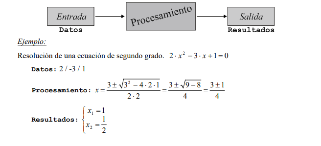
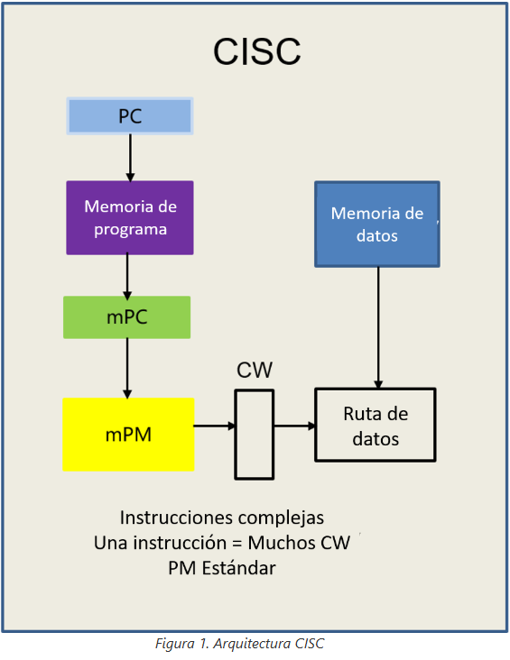
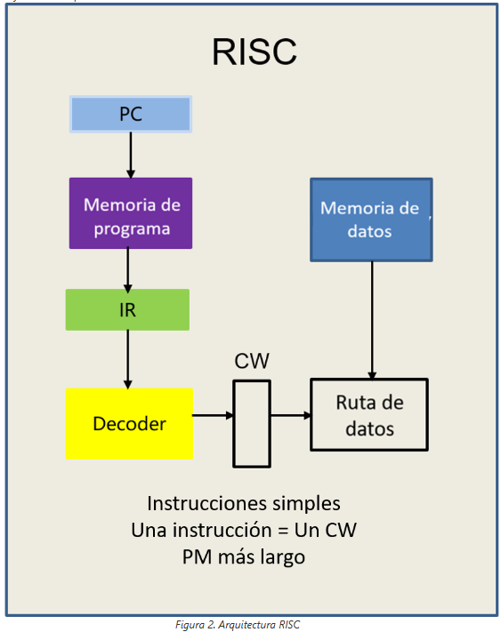
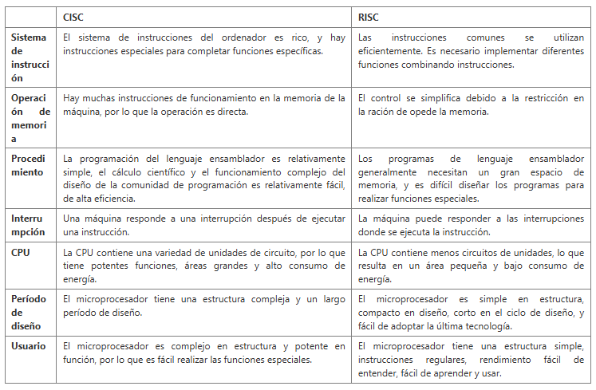
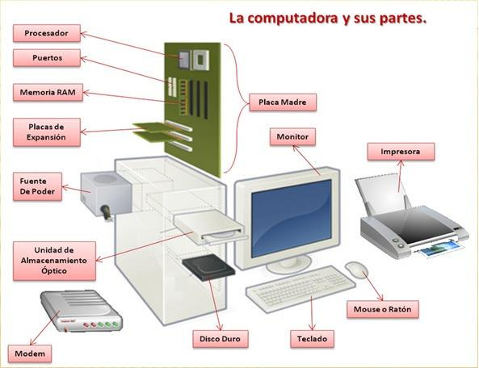

```

  , __                                                                                                            
 /|/  \                                                        o                          |                       
  |___/ ,_    _   __,         _  _  _|_  __,   ,     __   ,_       _   _  _  _|_  __,   __|   __   ,_    __,   ,  
  |    /  |  |/  /  | |   |  / |/ |  |  /  |  / \_  /  \_/  |  |  |/  / |/ |  |  /  |  /  |  /  \_/  |  /  |  / \_
  |       |_/|__/\_/|/ \_/|_/  |  |_/|_/\_/|_/ \/   \__/    |_/|_/|__/  |  |_/|_/\_/|_/\_/|_/\__/    |_/\_/|_/ \/ 
                   /|                                                                                             
                   \|                                                                                             


 ```

 ## 📤 Preguntas orientadoras

Las siguientes son unas preguntas orientadoras que Ustedes deben investigar y consignar en sus notas de clase. 

1. ¿Qué es un computador? Escribe una definición oficial y la referencia bibliográfica. 

    1. 
        Un computador es una máquina que podemos programar para procesar información.

        Así como nosotros tenemos códigos de comunicación, como los idiomas, para podernos comunicar entre nosotros; los compuadores también tienen codificaciones para procesar información.

        Esta codificación, no es Español, Inglés o Alemán, para los computadores usamos BITS (Binary digiT), es decir, 0 y 1.

    
    imagen ilustrativa


    - Las tareas que debe desempeñar un computador para procesar la información, son:


        -  Entrada de datos.
        - Salida de resultados
        - Procesamiento/Tratamiento de la información:
        -  Almacenamiento de datos y programas.
             - Recuperación de datos y programas.
            - (Los programas son los procedimientos correctos para tratar adecuadamente la información)

    [Universidad de Valencia](https://www.uv.es/afuertes/Informatica/ficheros/tema1_TI.pdf)

---

2. Arquitecturas de un computador: dar una breve definición de qué es una arquitectura de computador. Describir cómo están construidas y en qué equipos modernos se pueden encontrar.
    - Primero debemos diferenciar la arquitectura de la organización de un computador. Por un lado la arquitectura nos da una visión funcional, es decir la parte con la que se interactúa programando. Por otro lado la organización es la forma en la  construye una arquitectura con base en circuitos lógicos. Es decir, la arquitectura son técnicas que nos permiten contruir máquinas lógicas de forma práctica.

    [Universidad de la República Uruguay](https://www.fing.edu.uy/tecnoinf/mvd/cursos/arqcomp/material/teo/arq-teo05.pdf)

   
    1. Arquitectura CISC. 
    
        Sus siglas significan "Complex Instruction Set Computing". Este agrupa varias operaciones en una sola instrucción, los conjuntos de operaciones contenidas en instrucciones son muy ámplios permitiendo así el desarrollo de múltiples tareas. Es más adecuado para programas que necesiten alta compatibilidad y para el desarrollo de bajo nivel. Sin embargo el desarrollo de los microprocesadores es mucho más complejo. Algunos ejemplos de CISC son:
    - Intel x86 
    - AMD x86-65
    - Zilog Z80
    
     

    ---
    2. Arquitectura RISC

    Sus siglas significan "Reduced Instruction Set Computer", son más modernos que los CISC, estos utiizan comandos simples y la combinación de ellos para realizar diferentes tareas. Son más eficientes energéticamente y también para operaciones más simples; sin embargo para programación de bajo nivel ocupan muchísima más memoria dado que es operación por operación. Aunque en el caso del desarrollo de los microprocesadores, es mucho más rapido el desarrollo de RISC. 

    
    ---
    
    [Huawei Forum](https://forum.huawei.com/enterprise/intl/es/thread/%C2%BFcu%C3%A1l-es-la-diferencia-entre-las-arquitecturas-cisc-y-risc/667223574601154560?blogId=667223574601154560)
3. ¿Qué es el hardware? Incluye los más relevantes, te voy a dar algunos elementos, pero si encuentras más, los puedes incluir.
    
    El hardware es el conjunto de componentes físicos y tangibles de un computador. Hay hardware interno, como la placa base, la CPU, entre otros y Hardware externo como el teclado, el mouse e incluso una impresora. 
    
    
    
    1. CPU. Escribe una definición y sus partes más relevantes. 
        - La CPU es la unidad central de procesamiento de un computador, es el centro de control ya que recibe las instrucciones de la memoria, las decodificándolas y luego ejecutándolas, pudiendo así resolver operaciones lógicas y matemáticas. Recibe una entrada de datos y la transfroma en salida de información.
        
        - ALU. Definición y función.
            - Es la Unidad Aritmética Lógica, realiza las operaciones lógicas y aritméticas.
        
        - Unidad de control. Definición y función.
            - Ésta se encarga de buscar y decodificar las instrucciones dentro de la memoria para luego ejectuarlas. 
      
        - Registros. Definición y función.
            -  Almacena las instrucciones que se están ejecutando.

        - Buses. Definición y función.
            - Son vías por las cuales se comunica, direcciones, señales y datos entre diferentes partes y componentes de un computador. Existen 3 tipos, de acuerdo con el tipo de información que transportan  buses direcciones, señales y datos respectivamente.

        - Controlador de memoria (adicional a la consulta):
            - Regula el flujo de información entre el procesador y la memoria. 

        - Reloj:
            - Mantiene los cicruitos sincronizados emitiendo pulsos, la velocidad de esos pulsos se llaman frecuencia y se miden en hercios y megahercios.
    
    [IBM](https://www.ibm.com/mx-es/think/topics/central-processing-unit)

    2. Memoria
        - Registros
            - Se encuentran generalmente en la CPU, y almacenan temporalmente las instrucciones que se estén ejecutando.
        
        - Caché
            - Es una memoria de gran velocidad, se conidera auxiliar, esta vuelve más rapido el paso de información entre la RAM y la CPU.
        
        - Principal (RAM)
            - Es una memoria a corto plazo, almacena datos, programas y resultados ejecutados temporalmente. Para usos como gaming, una RAM con buena capacidad es esencial porque el juego utiliza esta memoria mientras está en uso. 
      
        - ROM
            - Read Only Memory. Se utiliza para almacenar información básica que no se quiere eliminar o modificar,se utiliza para almacenar el sistema basico de entrada y salida (BIOS), entre otras cosas. 

        - Secundaria (Disco duro y unidades externas de almacenamiento)
            - Son dispositivos de almacenamiento diferentes a los previamente mencionados, es decir no son esenciales para el funcionamiento del computador. Acá encontramos por ejemplo el disco duro, para almacenamiento de archivos y programas, las unidades o descos extraibles como USB flash, o en otras épocas CD's y Disquetes. 

        
    3. Dispositivos de entrada / salida
        - Son dispositivos que permiten la entrada y/o salida de datos del sistema, pueden ser integrados o no al computador. La cámaras web, micrófonos, teclados, escáneres e impresoras son excelentes ejemplos. 
   
    4. Buses de datos
    

4. ¿Qué es el software?
    1. Software de sistema
    2. Software de aplicación
    3. Software de desarrollo
5. Funcionamiento del computador:
    1. ¿Qué procesos se llevan a cabo cuando se enciende una computadora?
    2. ¿Qué sucede desde que ingreso un dato a través del teclado, hasta que veo el resultado de la operación en la pantalla?
    3. ¿Cómo se codifican los datos internamente en el computador?
    4. ¿Cuáles son las unidades de medida de datos en un computador? Bit, Byte, etc.