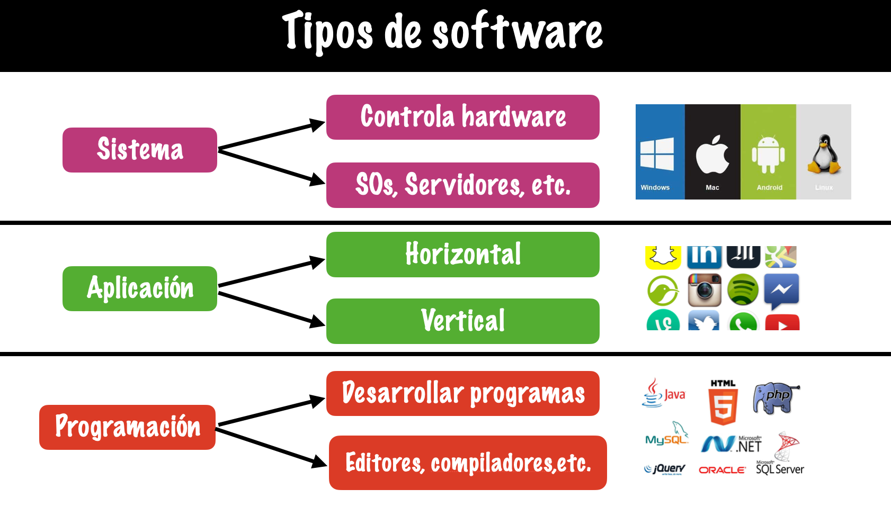
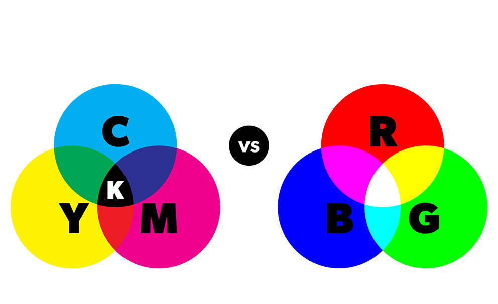
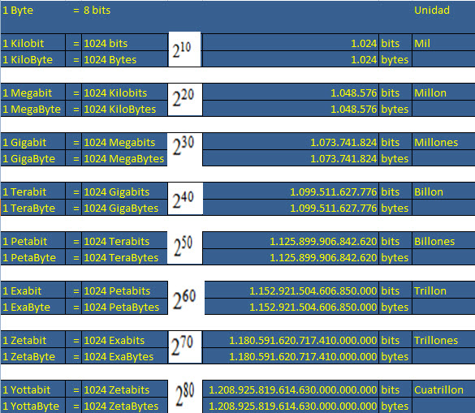

```

  , __                                                                                                            
 /|/  \                                                        o                          |                       
  |___/ ,_    _   __,         _  _  _|_  __,   ,     __   ,_       _   _  _  _|_  __,   __|   __   ,_    __,   ,  
  |    /  |  |/  /  | |   |  / |/ |  |  /  |  / \_  /  \_/  |  |  |/  / |/ |  |  /  |  /  |  /  \_/  |  /  |  / \_
  |       |_/|__/\_/|/ \_/|_/  |  |_/|_/\_/|_/ \/   \__/    |_/|_/|__/  |  |_/|_/\_/|_/\_/|_/\__/    |_/\_/|_/ \/ 
                   /|                                                                                             
                   \|                                                                                             


 ```

 ## 📤 Preguntas orientadoras

Las siguientes son unas preguntas orientadoras que Ustedes deben investigar y consignar en sus notas de clase. 

1. 쯈ué es un computador? Escribe una definición oficial y la referencia bibliográfica. 

    1. 
        Un computador es una máquina que podemos programar para procesar información.

        Así como nosotros tenemos códigos de comunicación, como los idiomas, para podernos comunicar entre nosotros; los compuadores también tienen codificaciones para procesar información.

        Esta codificación, no es Español, Inglés o Alemán, para los computadores usamos BITS (Binary digiT), es decir, 0 y 1.

    
    imagen ilustrativa


    - Las tareas que debe desempeñar un computador para procesar la información, son:


        -  Entrada de datos.
        - Salida de resultados
        - Procesamiento/Tratamiento de la información:
        -  Almacenamiento de datos y programas.
             - Recuperación de datos y programas.
            - (Los programas son los procedimientos correctos para tratar adecuadamente la información)

    [Universidad de Valencia](https://www.uv.es/afuertes/Informatica/ficheros/tema1_TI.pdf)

---

2. Arquitecturas de un computador: dar una breve definición de qué es una arquitectura de computador. Describir cómo están construidas y en qué equipos modernos se pueden encontrar.
    - Primero debemos diferenciar la arquitectura de la organización de un computador. Por un lado la arquitectura nos da una visión funcional, es decir la parte con la que se interactúa programando. Por otro lado la organización es la forma en la  construye una arquitectura con base en circuitos lógicos. Es decir, la arquitectura son técnicas que nos permiten contruir máquinas lógicas de forma práctica.

    [Universidad de la República Uruguay](https://www.fing.edu.uy/tecnoinf/mvd/cursos/arqcomp/material/teo/arq-teo05.pdf)

   
    1. Arquitectura CISC. 
    
        Sus siglas significan "Complex Instruction Set Computing". Este agrupa varias operaciones en una sola instrucción, los conjuntos de operaciones contenidas en instrucciones son muy ámplios permitiendo así el desarrollo de múltiples tareas. Es más adecuado para programas que necesiten alta compatibilidad y para el desarrollo de bajo nivel. Sin embargo el desarrollo de los microprocesadores es mucho más complejo. Algunos ejemplos de CISC son:
    - Intel x86 
    - AMD x86-65
    - Zilog Z80
    
     

    ---
    2. Arquitectura RISC

    Sus siglas significan "Reduced Instruction Set Computer", son más modernos que los CISC, estos utiizan comandos simples y la combinación de ellos para realizar diferentes tareas. Son más eficientes energéticamente y también para operaciones más simples; sin embargo para programación de bajo nivel ocupan muchísima más memoria dado que es operación por operación. Aunque en el caso del desarrollo de los microprocesadores, es mucho más rapido el desarrollo de RISC. Algunos ejemplos son:  ARM, DEC alpha y MIPS.

    
    ---
    
    [Huawei Forum](https://forum.huawei.com/enterprise/intl/es/thread/%C2%BFcu%C3%A1l-es-la-diferencia-entre-las-arquitecturas-cisc-y-risc/667223574601154560?blogId=667223574601154560)
3. 쯈ué es el hardware? Incluye los más relevantes, te voy a dar algunos elementos, pero si encuentras más, los puedes incluir.
    
    El hardware es el conjunto de componentes físicos y tangibles de un computador. Hay hardware interno, como la placa base, la CPU, entre otros y Hardware externo como el teclado, el mouse e incluso una impresora. 
    
    
    
    1. CPU. Escribe una definición y sus partes más relevantes. 
        - La CPU es la unidad central de procesamiento de un computador, es el centro de control ya que recibe las instrucciones de la memoria, las decodificándolas y luego ejecutándolas, pudiendo así resolver operaciones lógicas y matemáticas. Recibe una entrada de datos y la transfroma en salida de información.
        
        - ALU. Definición y función.
            - Es la Unidad Aritmética Lógica, realiza las operaciones lógicas y aritméticas.
        
        - Unidad de control. Definición y función.
            - Ésta se encarga de buscar y decodificar las instrucciones dentro de la memoria para luego ejectuarlas. 
      
        - Registros. Definición y función.
            -  Almacena las instrucciones que se están ejecutando.

        - Buses. Definición y función.
            - Son vías por las cuales se comunica, direcciones, señales y datos entre diferentes partes y componentes de un computador. Existen 3 tipos, de acuerdo con el tipo de información que transportan  buses direcciones, señales y datos respectivamente.

        - Controlador de memoria (adicional a la consulta):
            - Regula el flujo de información entre el procesador y la memoria. 

        - Reloj:
            - Mantiene los cicruitos sincronizados emitiendo pulsos, la velocidad de esos pulsos se llaman frecuencia y se miden en hercios y megahercios.
    
    [IBM](https://www.ibm.com/mx-es/think/topics/central-processing-unit)

    2. Memoria
        - Registros
            - Se encuentran generalmente en la CPU, y almacenan temporalmente las instrucciones que se estén ejecutando.
        
        - Caché
            - Es una memoria de gran velocidad, se conidera auxiliar, esta vuelve más rapido el paso de información entre la RAM y la CPU.
        
        - Principal (RAM)
            - Es una memoria a corto plazo, almacena datos, programas y resultados ejecutados temporalmente. Para usos como gaming, una RAM con buena capacidad es esencial porque el juego utiliza esta memoria mientras está en uso. 
      
        - ROM
            - Read Only Memory. Se utiliza para almacenar información básica que no se quiere eliminar o modificar,se utiliza para almacenar el sistema basico de entrada y salida (BIOS), entre otras cosas. 

        - Secundaria (Disco duro y unidades externas de almacenamiento)
            - Son dispositivos de almacenamiento diferentes a los previamente mencionados, es decir no son esenciales para el funcionamiento del computador. Acá encontramos por ejemplo el disco duro, para almacenamiento de archivos y programas, las unidades o descos extraibles como USB flash, o en otras épocas CD's y Disquetes. 

        
    3. Dispositivos de entrada / salida
        - Son dispositivos que permiten la entrada y/o salida de datos del sistema, pueden ser integrados o no al computador. La cámaras web, micrófonos, teclados, escáneres e impresoras son excelentes ejemplos. Una pantalla táctil, o una impresora con scanner son ejemplos bidireccionales. 
   
    4. Buses de datos
        - Son una serie de cables que permiten el flujo de información entre la CPU y la RAM, en este caso solo datos. 

    [EDteam](https://ed.team/comunidad/memoria-principal-y-secundaria)

4. 쯈ué es el software?

    1. Software de sistema
        - Es el que permite que el computador funcione incluye el sistema , los controles del sistema y sus utilitarios. 

    2. Software de aplicación
        - Programas que se utilizan para una funcion específica, como un procesador de texto, o bien una propia aplicación. 
    
    3. Software de desarrollo
        - Son herramientas digitales que permiten el desarrollo de nuevos programas, o la acutalización de los ya existentes. 

    [EuroInnova](https://www.euroinnova.com/blog/que-es-el-software-y-sus-componentes-basicos#:~:text=programa%20de%20software.-,Clasificaci%C3%B3n%20de%20software,desarrollo%20de%20los%20ya%20existentes.)

    

5. Funcionamiento del computador:
    1. 쯈ué procesos se llevan a cabo cuando se enciende una computadora?
   
    - Encendido de la alimantación: se energizan los componentes del sistema.

   - POST (Power-On Self Test): Con el sistema basico de entrada y salida se realiza un diagnóstico del hardware esencial.

   - Carga del BIOS: se inicializa el sistema basico de entrada y salida que permite cargar la configuracion básica del sistema.

    - Detección del dispositivo de arranque: el BIOS buca el dispositivo desde el cual se va a ejecutar el sistema operativo.

    - Carga del cargador de arranque: Se ejecuta el cargador de arranque y se carga el núcle del sistama operativo en la memoria del dispositivo.

    - Inicialización del sitema operativo: Se cargan los sericios y controladores del sistema operativo. 

    -  Pantalla de inicio de sesión: si es necesario, se presenta una forma de acceder para que el sistema cargue completamente.

    - Ahora se puefe usar el dispositivo. 

    [Hardzone](https://hardzone.es/tutoriales/montaje/arrancar-ordenador/)

    2. 쯈ué sucede desde que ingreso un dato a través del teclado, hasta que veo el resultado de la operación en la pantalla?
   
    - Entrada: El usuario oprime una tecla y el teclado envía una señal, cada técla tiene un código diferente. 

    - Direciión: El sistema operativo recibe esta señal única y éste le encía una señal al programa activo.

    - Procesamiento: se interpreta y se ejectua la operación desde la CPU.

    - Almacenamiento: Los datos se pueden almacenarse temporalmente en la memoria RAM.

    - Generación de salida: Wl programa da una respuesta con base en la operación realizada.

    - Visualización: La GPU convierte esto en señales de pantalla.

    - Salida de pantalla: Sale el resultado en la pantalla.

    [Microsoft](https://learn.microsoft.com/es-es/windows/win32/inputdev/about-keyboard-input)
   
    3. 쮺칩mo se codifican los datos internamente en el computador?
    
    - Los datos en loc computadores se codifican binariamente, con 0 y 1, ya que los circuitos solo pueden estar encendidos o apagados, 0 apagado 1 encendido.

        - Números: Se pasan de sistema decimal a binario

        - Letras: con estandares ACII o Unicode se le asigna un valor numérico a la letra, luego este se pasa a binario y se almacena.

        - Imágenes: Cáda pixel tiene un color dado por RGB (RED GREEN BLUE, el más usado para pantallas) ó CMYK, estos se representan por códigos de números asociados a cada color, es decir en RGB, un valor de rojo, uno de verde, y uno de azul, estos números se pasan a binario y se almacenan.
            - Dato curioso (teoría fotográfica del color): El sistema RGB viene derivado de los colores de los leds, y los tonos se basan en la iluminación. EL sistema CMYK se utiliza principalmente para tintas, dado que el objetivo es cubrir un fondo blanco con otros colores. Originalmente el proposito de RGB y CMYK era opuesto. En la intersección se ve como RGB es blanco porque busca iluminar, y CYMK busca oscurecer:

                
    
    - 
         - Sonido: se almacenn valores numéticos querepresentan la amplitud de onda en intervalos temporales. Estos valores se pasan a binario y se amacenan.

        -  Videos: Se codifican las imágenes y el sonido y se comprimen usando distintos formatos. Los valores númericos comprimidos se pasan a binario y se almacenan.

    [Universidad Politécnica de Cartagena](https://ocw.bib.upct.es/pluginfile.php/7809/mod_resource/content/1/031_040_capitulo_3_CODIFICACION_INTERNA_DE_LA_INFORMACION.pdf)


    4. 쮺uáles son las unidades de medida de datos en un computador? Bit, Byte, etc.

   -  Las unidades de medida de daros en un computador están dadas por potencias en base 2.
   Un bit es la unidad mínima de medida de cantidad de información, equivalente a la probailida entre dos opciones. Es decir un solo dígito, que puede ser 1 o 0.

        -  A partir de eso tenemos estos valores: 

    

    [IBM](https://www.ibm.com/docs/es/storage-insights?topic=overview-units-measurement-storage-data)

    

Santiago Palacio Vargas 2025