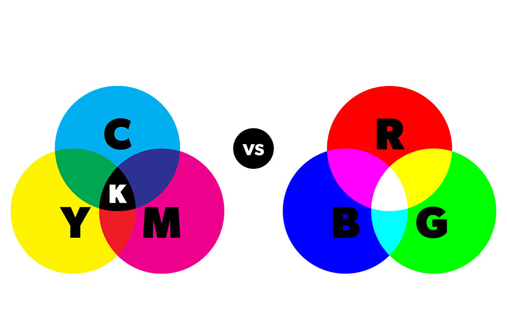
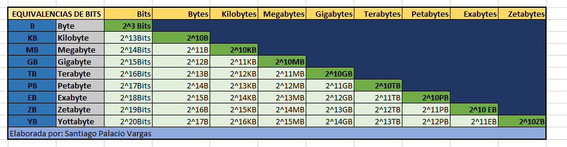
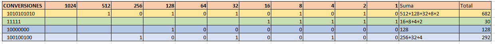
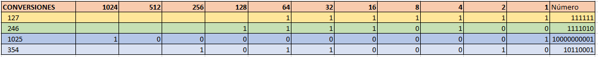
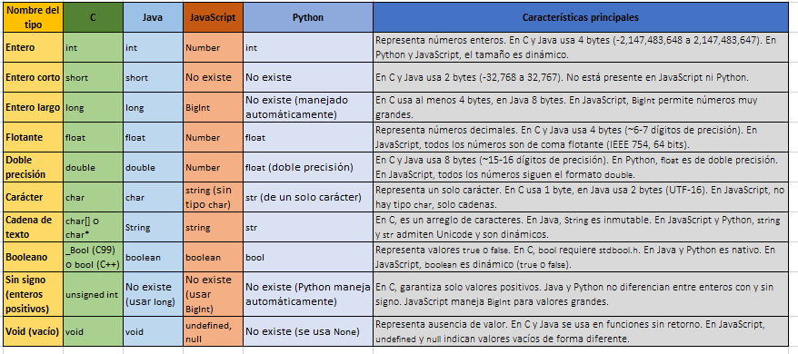

## 📤 Para la bitácora

1. Escribe un párrafo explicando, en tus propias palabras, cómo se representan los datos en una computadora. Por ejemplo, ¿cómo se ingresan números, letras, imágenes a una computadora?

    
    - Los datos en loc computadores se codifican binariamente, con 0 y 1, ya que los circuitos solo pueden estar encendidos o apagados, 0 apagado 1 encendido.

        - Números: Se pasan de sistema decimal a binario

        - Letras: con estandares ACII o Unicode se le asigna un valor numérico a la letra, luego este se pasa a binario y se almacena.

        - Imágenes: Cáda pixel tiene un color dado por RGB (RED GREEN BLUE, el más usado para pantallas) ó CMYK, estos se representan por códigos de números asociados a cada color, es decir en RGB, un valor de rojo, uno de verde, y uno de azul, estos números se pasan a binario y se almacenan.
            - Dato curioso (teoría fotográfica del color): El sistema RGB viene derivado de los colores de los leds, y los tonos se basan en la iluminación. EL sistema CMYK se utiliza principalmente para tintas, dado que el objetivo es cubrir un fondo blanco con otros colores. Originalmente el proposito de RGB y CMYK era opuesto. En la intersección se ve como RGB es blanco porque busca iluminar, y CYMK busca oscurecer:

                
    
    - 
         - Sonido: se almacenn valores numéticos querepresentan la amplitud de onda en intervalos temporales. Estos valores se pasan a binario y se amacenan.

        -  Videos: Se codifican las imágenes y el sonido y se comprimen usando distintos formatos. Los valores númericos comprimidos se pasan a binario y se almacenan.


2. Luego de realizar el ejercicio 1, escribe tus conclusiones acerca de la pregunta planteada en la Figura 2. ¿Cuántos estados diferentes pueden ser representados por N variables binarias?


    ```
    2**N ó 2^N
    ```

3. ¿Cuáles son las unidades de almacenamiento de datos que se utilizan en computación? Crea una tabla donde muestres estas unidades con sus prefijos. En este caso me refiero a KiloByte, MegaByte, etc. 

    


4. Incluye un pequeño resumen, de un par de renglones, donde menciones la importancia del trabajo de George Bool en este tópico.

-  El trabajo de Boole permite que los computadores puedan funcionar, ya que con una lógica binaria se puede representar la energización o ausencia de energía en los circuitos, es decir estado encendido y apagado. Sin embargo no se reduce solo a eso, dado que con una lógica binaria, se puede tener un valor de verdad, haciendo así posibles los loops. Si la lógica Booleana binara no existiese, no tendríamos sistemas de cómputo como los conocemos-


## 📤 Ejercicio 2 - Resuelve y deja evidencia en la bitácora

Ahora es tu turno de intentar usar el método. Te voy a proponer varios números binarios y tú vas a convertirlos a decimales utilizando la `tabla 3`. Recuerda que el subíndice 2 significa que el número es binario (base 2)

- $1010101010_2$
- $11111_2$
- $10000000_2$
- $100100100_2$



## 📤 Ejercicio 2 - Resuelve y deja evidencia en la bitácora

Ahora es tu turno. Vas a convertir los siguientes  números decimales a binarios. Recuerda que el subíndice 10 significa que el número es decimal (`base 10`)

- $127_{10}$
- $246_{10}$
- $1025_{10}$
- $354_{10}$



## 📤 **3. Actividad de investigación (para la bitácora)**

Investiga los diferentes tipos de datos que se utilizan en varios lenguajes de programación (por ejemplo, C, Java, Python). Ten en cuenta cómo cada lenguaje define los números enteros, los decimales (o flotantes), las letras del alfabeto, las cadenas de texto, valores booleanos, entre otros. Investiga qué nombres se asignan y qué abreviaciones se utilizan en cada lenguaje.

## 📤 **4. Organización de resultados**

Con la información recolectada, organiza los datos en una tabla que incluya:

- **Nombre de la variable**
- **Abreviación (si existe)**
- **Características principales** (rango, tipo de valor, etc.)



[Arquitectura de sistemas UC3M](https://www.it.uc3m.es/pbasanta/asng/course_notes/data_types_es.html)


[IBM](https://www.ibm.com/docs/es/iis/11.5?topic=jrules-basic-java-types-methods)

[Lenguaje JS](https://lenguajejs.com/javascript/tipos/que-son/)

[Ionos](https://www.ionos.mx/digitalguide/paginas-web/desarrollo-web/python-data-types/)

[Chat GPT + formato propio](https://chatgpt.com/c/67a60c34-1180-800a-a46f-a85d174a4432)


## 📤 **5. Ejercicio de cálculo de espacio en memoria**

Imagina que necesitas almacenar la siguiente información en un programa:

- Un identificador numérico (número entero)
- Una temperatura (valor de punto flotante)
- Un valor lógico (dato booleano)
- Un texto con 10 caracteres.

Se almacena la información cada 10 segundos durante 24 horas. Calcula cuánto espacio total se requiere en memoria para almacenar estos datos. Describe el procedimiento y muestra el resultado final.


- Se almacena un registro cada 10 segundos.
- 24 horas = 86,400 segundos.
- Esto lo dividimos entre 10 = 8640

Esteresultado lo multiplicamos por el numero de Bytes de cada tipo de dato


- int → 8640 × 4 → 34560 bytes (33.75 KB)
- float → 8640 × 4 → 34560 bytes (33.75 KB)
- _Bool → 8640 × 1 → 8640 bytes (8.44 KB)
- char[10] → 8640 × 10 → 86400 bytes (84.38 KB)

## 📤 **6. Conclusión**

Finalmente, explica con tus propias palabras el resultado de esta actividad y qué aprendiste acerca de la representación de datos en las computadoras.

- Antes de empezar a programar, debemos saber la forma en la que entienden los computadores. La lógica booleana,que permite representar los estados encendido y apagado, nos lleva al core del funcionamiento de un computador, a lo más básico, y luego vamos subiendo progresivamente, al almacenamiento de información en conjuntos de 8 bits llamados bytes, y a raíz de eso, también comprendemos las unidades de almacenamiento y que significan. Luego, pudimos ver cuanto almacenamiento ocupaban y cómo se almacenaban los diferentes tipos de variables en los lenguajes de programación, entendiendo la importancia de especificar, optimizar, pero lo más importante es saber cómo se almacenan los datos que posteriormente ingresaremos.

