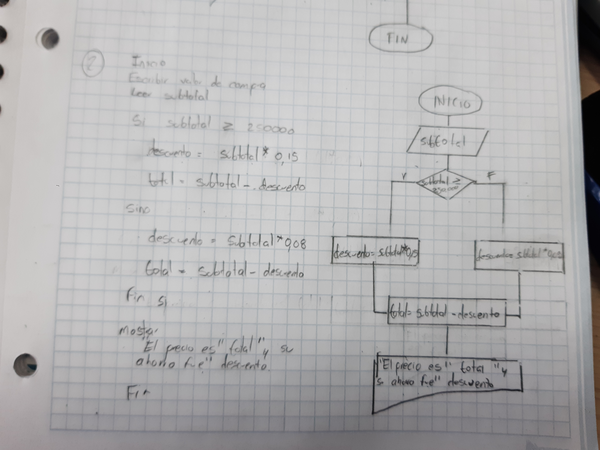
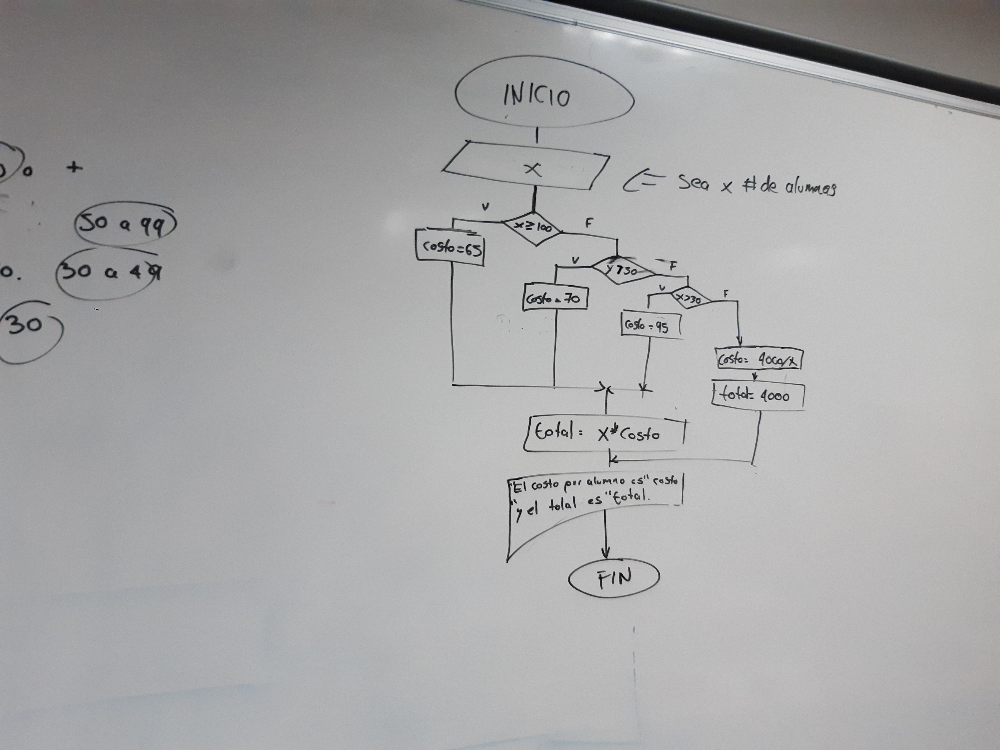
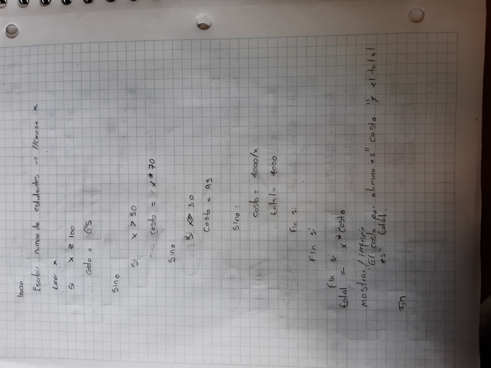

                                                                                                                    

## 📤 Ejercicio 1.

Investiga cuáles son los símbolos que se utilizan para representar cada operación de un algorimo con un diagrama de flujo. Asegúrate de que la fuente es confiable, discute lo que encontraste con tus compañeros y con el profe. Cuando estés seguro/a de tener los símbolos correctos, consigna la información en la bitácora.


## Ejercicio 2

Analicemos el siguiente problema y representemos su solución mediante un algoritmo secuencial.

- Construye un algoritmo que, al recibir como datos **el ID** del empleado y los seis primeros sueldos del año, calcule el ingreso total semestral y el promedio mensual, e imprima el ID del empleado, el ingreso total y el promedio mensual.


### Solución en Diagrama de Flujo


### Solución en Pseudocódigo

```txt:

INICIO

Escribir "Ingrese una letra, si escoge la correcta se lleva un premio mágico"

Leer x

si x =  "y":
    i = 10
    Mientras i>0:

        Escribir "Hola"

        i = i - 1

    Fin Mientras

Si no:
    
    Escribir "Hola

Fin Si

Fin

```
### Solución en C

```c:
#include <stdio.h>

int main(void)
{
    char x;
    int i;
    
    printf("Ingrese una letra, si escoge la correcta se lleva un premio mágico\n");
    
    scanf("%c", &x);
    
    if(x=='y'){
        
        i = 10;
        
        while(i > 0){
            
            printf("Hola\n");
            i = i-1;
        }
    }
    
    else{
        printf("Hola\n");
    }
    return 0;
}


```
### Solución en Python
```python:

x = input("Ingrese una letra, si escoge la correcta se lleva un premio mágico").lower()
if x != "y":
    print("hola")

else:
    z = 0
    while z <= 10:
        print("hola")
        z = z+1

```
## Ejercicios

### Ejercicio 1:

Realice un algoritmo para determinar cuánto se debe pagar por equis cantidad de lápices considerando que si son 1000 o más el costo es de $85 cada uno; de lo contrario, el precio es de $90. Represéntelo con el pseudocódigo y el diagrama de flujo.


#### Solución complementaria en Python

```python:
x = int(input("Cantidad de lápices"))

if x  >= 1000:
    y = 85*x
    
else:
    y = 90*x
    
print(y)

```

## Ejercicio 2

Un almacén de ropa tiene una promoción: por compras superiores a $250 000 se les aplicará un descuento de 15%, de caso contrario, sólo se aplicará un 8% de descuento. Realice un algoritmo para determinar el precio final que debe pagar una persona por comprar en dicho almacén y de cuánto es el descuento que obtendrá. Represéntelo mediante el pseudocódigo y el diagrama de flujo.



#### Solución complementaria en Python

```python:

subtotal = int(input("ingrese valor de la compra"))

if subtotal >= 250000:
    descuento = subtotal*0.15
    
else:
    descuento = subtotal*0.08
    
total = subtotal - descuento

print(f"El precio es {total} y el descuanto es {descuento}")

```

### Ejercicio 3

El director de una escuela está organizando un viaje de estudios, y requiere determinar cuánto debe cobrar a cada alumno y cuánto debe pagar a la compañía de viajes por el servicio. La forma de cobrar es la siguiente: si son 100 alumnos o más, el costo por cada alumno es de $65.00; de 50 a 99 alumnos, el costo es de $70.00, de 30 a 49, de $95.00, y si son menos de 30, el costo de la renta del autobús es de $4000.00, sin importar el número de alumnos.




Nota el total puede ser el mismo para todo, ya que para el caso de menos de 30 el costo es 4000/x si tenemos en cuenta total = x*costo, entonces se cancelaría el denominador e igual quedaría como 4000
#### Solución complementaria en Python

```python:
x = int(input("número de estudaintes"))

if x >= 100:
    costo = 65
else:
    if x > 50: 
        costo = 70
    else:
        if x > 30:
            costo = 95
        else:
            costo = 4000/x
total = x*costo

print(f"Dado que el costo por alumno es {costo}, el total sería {total}")
```


# 📤 **Consigna tus respuestas en la bitácora**

A continuación, se presentan enunciados relacionados con los temas tratados en el texto. Los estudiantes deben responder si los enunciados corresponden o no con las definiciones o conceptos aprendidos.

### Parte 1: Identificar Algoritmos

Responde si los siguientes enunciados representan un algoritmo. Justifica la respuesta:

1. Una página web.

    - Tenemos algoritmos en la parte programable de la página, es decir en el backend, trabajese con python, javascript, jason, entre otros, ya que acá se tienen una serie de funciones y pasos definidos para el funcionamiento de la página. Por otro lado, no habría algoritmos en los archivos de formato, como el html, ya que es solo organizar por medio de tags los algoritmos previamente definidos. 


---

2. Una receta para hacer un pastel, donde se indican ingredientes y pasos a seguir.

    - Efectivamente es un algoritmo, ya que los ingredientes del pastel son finitos, los ingredientes están derfinidos.

---
3. "Piensa en un número y multiplícalo por otro".

    - Es un algoritmo, tiene finitud pues consta de una operación clara, estos números se definen por el usuario. Y tiene orden.

---

4. Un manual de instrucciones para armar un mueble, con pasos detallados y un orden claro.

    - Tiene inicio y fin, hay claridad en los pasos y están definidos. Por ende es un algoritmo.

---

5. Una lista de compras organizada en orden alfabético

    - No es un algoritmo, ya que no es una secuencia de instrucciones sino una lista de datos. No tiene un fin claro. ya que posría comprarse todo el supermercado.

    ---

### Parte 2: Variables y Constantes

Indica si las siguientes afirmaciones describen una variable o una constante:

1. El valor de la gravedad en la Tierra, 9.8 m/s².

 - Es constante, ya que en la tierra siempre el valor de la gravedad es el mismo por está definido por medio de la constante g=9,8m/s²

---

2. La edad de una persona calculada en base al año actual y su año de nacimiento.

    - Es una variable, ya que el año puede cambiar. Sin embargo, el año de nacimiento siempre será constante.
---

3. La cantidad de dinero en una cuenta bancaria.

    - Teniendo en mente las consignaciones, los retiros, cuotas de manejo de trajetas e intereses ganados, el saldo siempre cambiará, por ende es variable.

---


4. La velocidad de la luz en el vacío, 299,792,458 m/s.

    - Es contante, y está definida por la constante por c = 299,792,458 m/s, podemos encontrar esta contante en fórmulas como: E = mc²

---

5. El radio de un círculo.

    - Es variable, dado que el radio depende de la distancia entre el centro y la circunferencia, por ende si se cambia la magnitud de la figura, cambiaría el radio.

---


### Parte 3: Características de los Algoritmos

Responde si los siguientes enunciados cumplen con las características de un algoritmo. Justifica la respuesta:

1. Para elegir la ruta más corta entre varias ciudades, el algoritmo examina rutas candidatas, deteniéndose cuando los cambios en la distancia parecen lo suficientemente pequeños.
2. Suma los números ingresados y muestra el resultado.
3. Un conjunto de pasos para calcular el área de un rectángulo dado su base y altura.
4. El algoritmo cuenta el número de votos obtenidos por cada uno de los candidatos de una elección para presidente. Empieza solicitando el nombre del candidato y finaliza cuando se ingresa el valor -1.

### Parte 4: Comprensión de Herramientas

Indica si las siguientes afirmaciones son ciertas o falsas respecto al pseudocódigo y diagramas de flujo:

1. El pseudocódigo utiliza símbolos estándar para representar las operaciones lógicas.
2. Los diagramas de flujo son una representación gráfica de un algoritmo.
3. El pseudocódigo debe estar escrito en un lenguaje de programación específico.
4. Un diagrama de flujo siempre debe tener un inicio y un fin claramente definidos.

### Parte 5: Estructuras de Control

Describe para qué sirven las estructuras de control. Redacta dos ejemplos, uno de tu vida diaria, es decir cuando tienes que tomar decisiones en tus actividades diarias y oto ejemplo en el que se tengan que utilizar cálculos matemáticos para tomar una u otra decisió