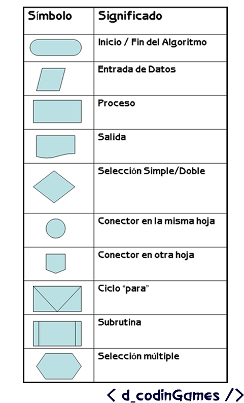
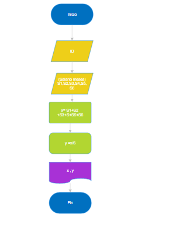
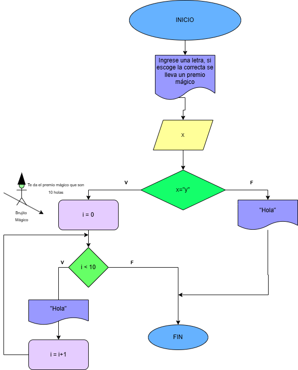

                                                                                                                    

## 📤 Ejercicio 1.

Investiga cuáles son los símbolos que se utilizan para representar cada operación de un algorimo con un diagrama de flujo. Asegúrate de que la fuente es confiable, discute lo que encontraste con tus compañeros y con el profe. Cuando estés seguro/a de tener los símbolos correctos, consigna la información en la bitácora.




## Ejercicio 2

Analicemos el siguiente problema y representemos su solución mediante un algoritmo secuencial.

- Construye un algoritmo que, al recibir como datos **el ID** del empleado y los seis primeros sueldos del año, calcule el ingreso total semestral y el promedio mensual, e imprima el ID del empleado, el ingreso total y el promedio mensual.




### Solución en Diagrama de Flujo




### Solución en Pseudocódigo

```txt:

INICIO

Escribir "Ingrese una letra, si escoge la correcta se lleva un premio mágico"

Leer x

si x =  "y":
    i = 10
    Mientras i>0:

        Escribir "Hola"

        i = i - 1

    Fin Mientras

Si no:
    
    Escribir "Hola

Fin Si

Fin

```
### Solución en C

```c:
#include <stdio.h>

int main(void)
{
    char x;
    int i;
    
    printf("Ingrese una letra, si escoge la correcta se lleva un premio mágico\n");
    
    scanf("%c", &x);
    
    if(x=='y'){
        
        i = 10;
        
        while(i > 0){
            
            printf("Hola\n");
            i = i-1;
        }
    }
    
    else{
        printf("Hola\n");
    }
    return 0;
}


```
### Solución en Python
```python:

x = input("Ingrese una letra, si escoge la correcta se lleva un premio mágico").lower()
if x != "y":
    print("hola")

else:
    z = 0
    while z <= 10:
        print("hola")
        z = z+1

```
