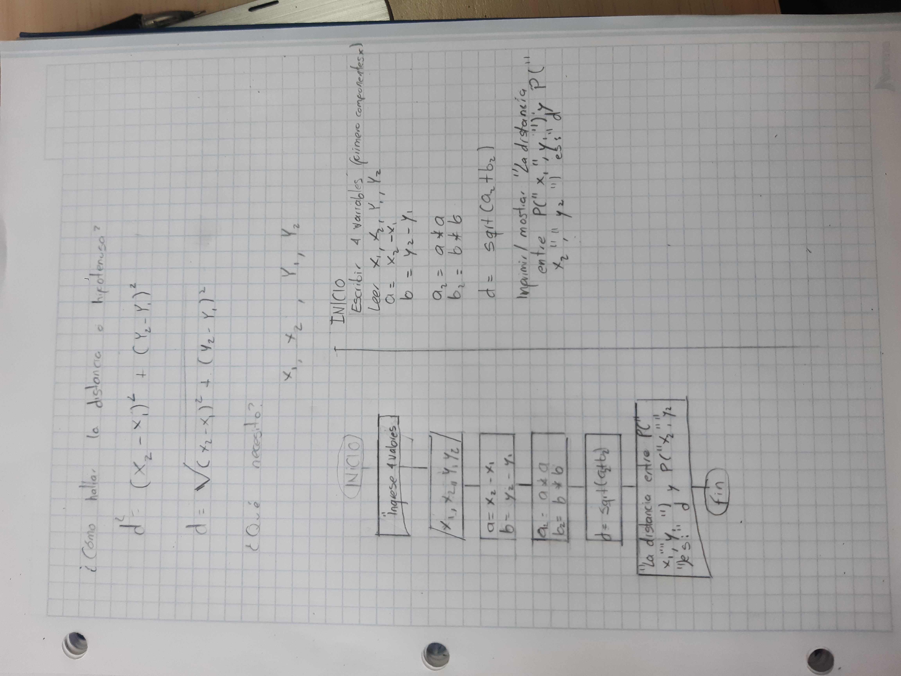
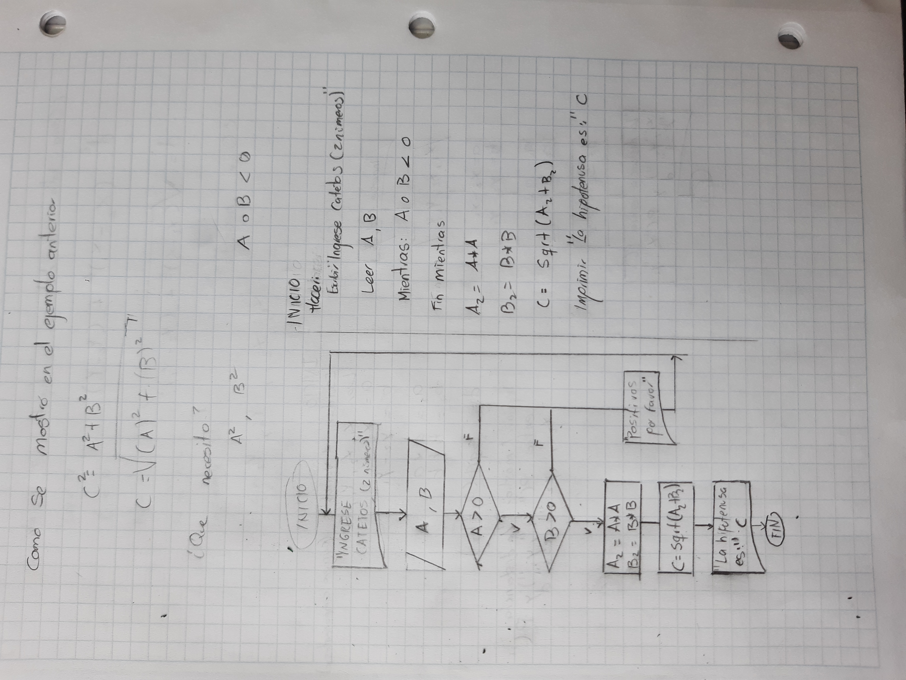
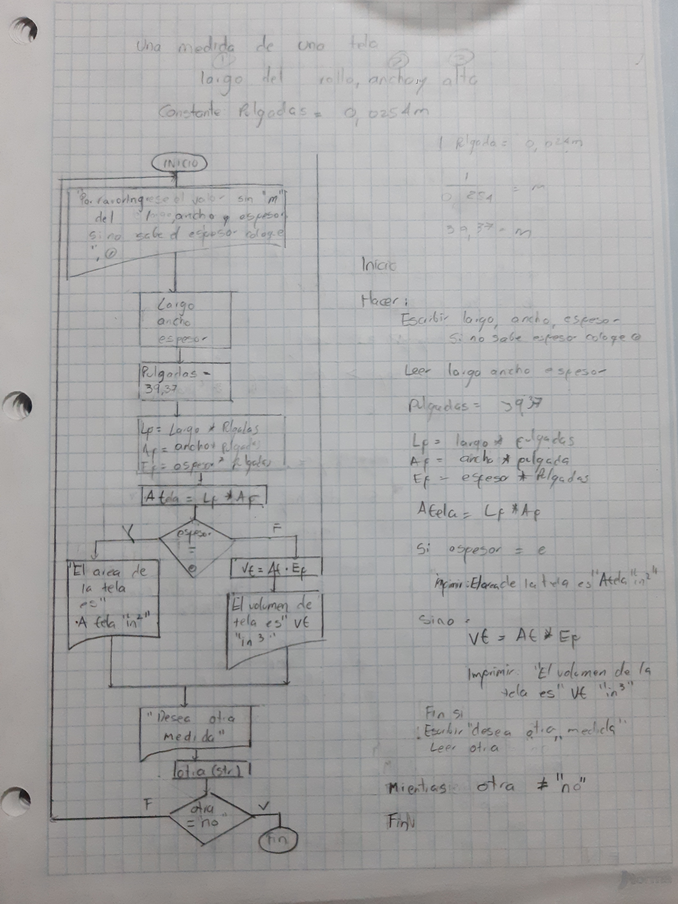
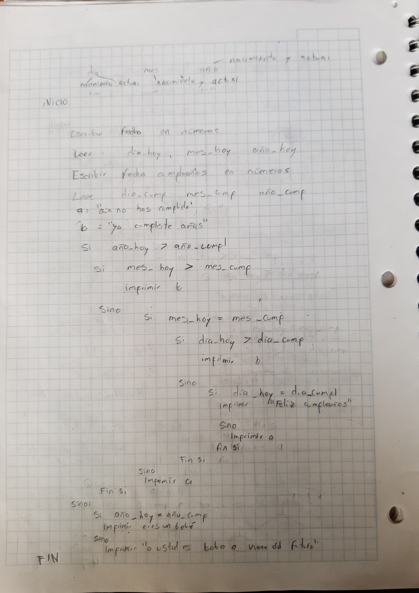
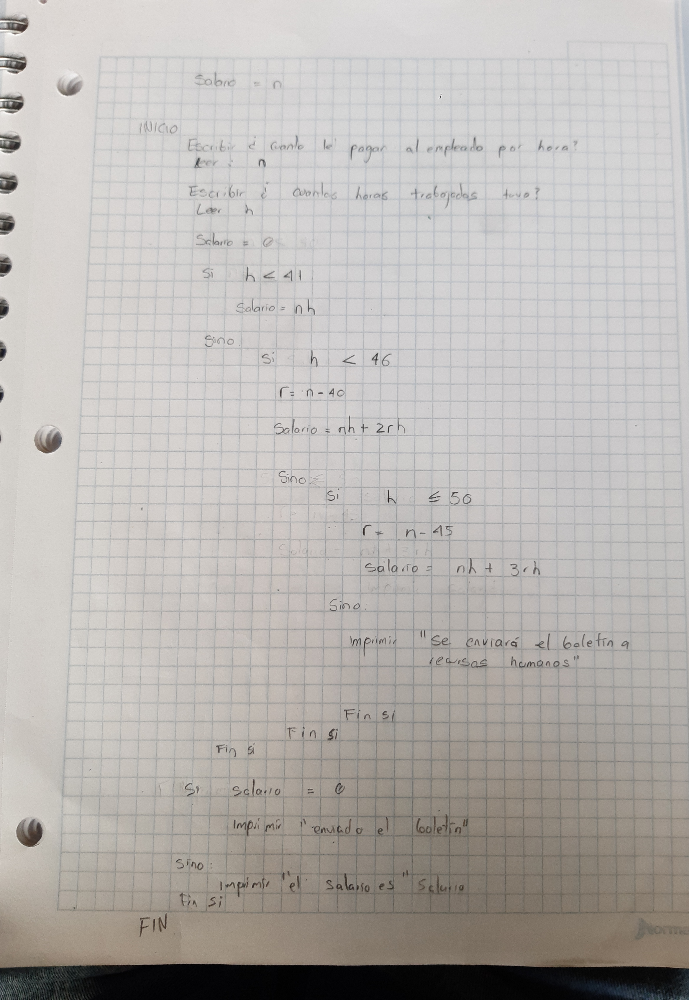

## 1. Introducción

¿Alguna vez te has preguntado cómo convertir un conjunto de pasos lógicos (pseudocódigo) en un programa funcional en C?

Este tutorial te guiará a través del proceso de:

1. Interpretar tu pseudocódigo.
2. Traducirlo a sintaxis C.
3. Añadir detalles específicos (tipos de datos, prototipos de funciones, etc.).

Pregunta orientadora:
 - ¿Por qué crees que el pseudocódigo es útil antes de escribir un programa en C?

    - Al escribir un pseudocódigo, o bien un diagrama de flujo, se plasma la solución en un conjunto de pasos en un orden lógico y conciso, volviendo así la solución un algoritmo de comando simples, que son fáciles de traducir a cualquier lenguaje de programación para ser ejecutados.Incluso desde el pesudocódigo es fácil detectar errores en la prueba de escritorio que eahooran mucho tiempo después.  


---

## 2. Estructura básica del pseudocódigo

Generalmente, el pseudocódigo se escribe en un lenguaje “amigable” que describe el **orden de las operaciones**. Por ejemplo:

```
INICIO
    Leer valor1
    Leer valor2
    suma = valor1 + valor2
    Mostrar suma
FIN
```

> Actividad
> 
> - Toma un pseudocódigo de un ejercicio anterior o escribe tu propio pseudocódigo, similar al mostrado en el ejemplo de arriba.

```txt

INICIO

condición = 1
veces  = 0
suma_estatura = 0

mientras condición diferente de 0

	
		Escribir “ ingrese estatura”

		Leer estatura

		suma_estatura = suma_estatura + estatura
	

si estatura <= 0

			condición = 0
			suma_estatura = suma_estatura - estatura

sino
veces = veces +1

fin si


fin mientras

si veces = 0

	mostrar no hay promedio, la división por 0 no está definida

sino 
promedio = suma_estatura/veces

mostrar promedio

fin si
FIN

```


**Retos**:

1. **Claridad**: Asegúrate de que cada paso esté claro y sea fácil de entender.
2. **Secuencia**: Verifica que tu pseudocódigo siga el orden lógico (entrada → procesamiento → salida).

---

## 3. Traduciendo el pseudocódigo a C

Cuando traducimos un pseudocódigo a C, debemos prestar atención a:

- **Declaración de variables**: En C, es **obligatorio** especificar el tipo de cada variable (int, float, etc.).
- **Funciones de entrada/salida**: `scanf` para leer datos, `printf` para mostrar resultados.
- **Estructuras de control**: `if`, `while`, `for`, etc.

### Ejemplo de pseudocódigo a C

Pseudocódigo:

```
INICIO
    Leer valor1
    Leer valor2
    suma = valor1 + valor2
    Mostrar suma
FIN
```

Versión en C (programa completo):

```c
#include <stdio.h>

int main() {
    float valor1, valor2, suma;

    printf("Ingresa el primer número: ");
    scanf("%f", &valor1);

    printf("Ingresa el segundo número: ");
    scanf("%f", &valor2);

    suma = valor1 + valor2;
    printf("La suma es: %.2f\n", suma);

    return 0;
}
```


> Pregunta orientadora
 - ¿Por qué es importante declarar el tipo de variable (int, float, etc.) antes de usarla en C?

    - En los diferentes lemguajes de progrmación el tipo de varibales ocupan un diferente tipo de bytes. Cuando declaramos una variable,reservamos un espacio en la memoria para almacenar el valor que esta tome, es importante saber que tipo de variable es para saber que tanta memoria se reserva. Dejando de lado la memoria, es importante tener en mente que un tipo de caracter se puede usar como diferentes tipos de datos, por ejemplo, los números, en una contraseña o ID, se alacenan como string; pero para sumar cantidades los números se utilizan como enteros o flotantes, o inclusive se les pueden aumentar las cifras decimales. Dado esto, resulta fundamental declarar los tipos de datos desde el principio de acuerdo con el uso que se les dará,
---

## 4. Ejemplos adicionales de pseudocódigo y su traducción

**¡Importante!**

Estos ejemplos te ayudarán a ver la correspondencia entre el lenguaje natural del pseudocódigo y las instrucciones del lenguaje C. No te preocupes si no dominas todos los aspectos aún o si aún no conoces la sintaxis de C; lo importante es que veas cómo se transforman los pasos lógicos en sintaxis.

### Ejemplo 1: Encontrar el mayor de dos números

**Pseudocódigo**:

```
INICIO
    Leer num1
    Leer num2
    Si num1 > num2 Entonces
        Mostrar "El número 1 es mayor"
    Sino
        Mostrar "El número 2 es mayor"
FIN
```

**Lenguaje C**:

```c
#include <stdio.h>

int main() {
    float num1, num2;

    printf("Ingresa el primer número: ");
    scanf("%f", &num1);
    printf("Ingresa el segundo número: ");
    scanf("%f", &num2);

    if (num1 > num2) {
        printf("El número 1 es mayor\n");
    } else {
        printf("El número 2 es mayor\n");
    }

    return 0;
}
```

### Ejemplo 2: Calcular factorial de un número

**Pseudocódigo**:

```
INICIO
    Leer n
    factorial = 1
    Para i desde 1 hasta n
        factorial = factorial * i
    Mostrar factorial
FIN
```

**Lenguaje C**:

```c
#include <stdio.h>

int main() {
    int n;
    long factorial = 1;

    printf("Ingresa un número entero: ");
    scanf("%d", &n);

    for(int i = 1; i <= n; i++) {
        factorial *= i;
    }

    printf("El factorial es: %ld\n", factorial);

    return 0;
}
```

> Actividad
> 
- Escribe tu propio pseudocódigo para calcular el promedio de una lista de calificaciones y tradúcelo a C.

 - Pseudocódigo

 ```txt
INICIO

Escribir número de calificaciones a ingresar
leer n
controlador = 0
suma = 0 

Mientras controlador <= n
	
	Escribir “ingrese la calificación”

	Leer calificación
	
	suma = suma + calificación

	controlador = controlador +1
Fin mientras

promedio = suma / n
	
FIN
 ```

- Código en C

```C
#include <stdio.h>

int main() {
    int n, controlador = 0;
    float suma = 0, calificacion, promedio;

    printf("Ingrese el número de calificaciones: ");
    scanf("%d", &n);

    while (controlador < n) {
        printf("Ingrese la calificación: ");
        scanf("%f", &calificacion);
        suma = suma + calificacion;
        controlador = controlador + 1;
    }

    promedio = suma / n;
    printf("El promedio es: %f\n", promedio);

    return 0;
}
```


---

## 5. Buenas prácticas

1. **Comentarios**: Utiliza `/* comentario */` o `// comentario` para describir líneas clave.
2. **Funciones**: Divide tu código en funciones para mantenerlo ordenado.
3. **Convenciones de nombres**: Utiliza nombres descriptivos para variables y funciones.

 - Código anterior en C con comentrarios:


```C
#include <stdio.h>

int main() {
    int n, controlador = 0; //usamos n y controlador aparte, como hay que sacar un promedio, se necesita el valor de n
    float suma = 0, calificacion, promedio; //Las calificaciones tienen decimales, por ende sus promedios también

    printf("Ingrese el número de calificaciones: ");// importante saber cuantas son para que el algoritmo sea finito
    scanf("%d", &n);

    while (controlador < n) {
        printf("Ingrese la calificación: ");
        scanf("%f", &calificacion);
        suma = suma + calificacion;
        controlador = controlador + 1;
    } // tenemos un bucle con controlador como condicion iterante, para no afectar el valor de n, que es por el valor que se divide para obtener el promedio. 

    promedio = suma / n;
    printf("El promedio es: %f\n", promedio);

    return 0;
}
```


> Pregunta orientadora
> 
- ¿Por qué es importante comentar el código, aunque sea breve y conciso?

    - Es altamente probble que el código lo lea y/o lo edite otra persona, por ende es fundamental cerciorarse de que la otra persona entienda.  Esto se puede complementar nombrando las variables de una forma coherente, para que sean intuitivamente entendibles y el comentario sea más relevante. También por medio de la lectura de comentarios es más fácil identificar, la similitud entre estructuras de código, por si en la posteridad se requiere una serie de passo similares. O bien, al sintetizar nuevamente en palabras lo que se quiere hacer, se puede ver si hay redundancias o falta algo.

---

## 6. Reto final

### Reto: toma el pseudocódigo de los 5 primeros ejercicios del Reto y realiza la traducción a C:

1. Revisa el pseudocódigo y verifica que no contenga errores.
2. **Traduce** ese pseudocódigo a C.
3. **Comenta** tu código para explicar los pasos principales.

---

## Reto 1


```txt

INICIO

	Escribir “cuatro variables primero las 2 componentes de x, y luego las dos de y”
	Leer x1, x2, y1, y2

	a = x2 -x1
	b = y2 - y1

	a2 = a * a

	b2 = b *b
	
	d = sqrt(a2 + b2)
	imprimir “la distancia entre P(”x1”, “y1”) y P(”x2”, “y2”) es:” d
FIN

```

```c
#include <stdio.h>
#include <math.h> // se incluye la librería para la función sqrt()

int main() {
    double x1, x2, y1, y2; // variables de entrada
    double a, b, a2, b2; // variables auxiliares
    double d; // variable de salida
    
    printf("Cuatro variables: primero las 2 componentes de x, luego las dos de y\n");
    scanf("%lf %lf %lf %lf", &x1, &x2, &y1, &y2);
    //lf se utiliza para double, f solo es para float

    a = x2 - x1;
    b = y2 - y1;
    // volvimos las diferencias de las componentes, una sola variable por componente
    
    a2 = a * a;
    b2 = b * b;

    // elevamos las variables auxiliares al cuadrado
    
    d = sqrt(a2 + b2);

    //sacamos la raiz de la fórmula
    
    printf("La distancia entre P(%f, %f) y P(%f, %f) es: %f\n", x1, y1, x2, y2, d);
    // le damos formato a la salida

    return 0;
}

```
---
## Reto 2

 - Imagen



 - Pseudocódigo

```txt
INICIO
Hacer

	Escribir “ingrese catetos (2 números)”

	Leer A, B

Mientras

A ó B < 0

A2 = A*A

B2 = B*B

C = sqrt(A2+ B2)

Imprimir “la hipotenusa es:” C

FIN

```
 - Código en C

```c
#include <stdio.h>
#include <math.h> // para usar sqrt() necesitamos incluir la librería

int main() {
    double A, B; // variables de entrada
    double  A2, B2; // variables auxiliares
    double  C; // salida
    
    do {
        printf("Ingrese catetos (2 números): ");
        scanf("%lf %lf", &A, &B);
    } while (A < 0 || B < 0);
    // usamos "ó" en el while, si A o B es negativo, no pueden haber lados negativos de un tríangulo y pedimos que se repita

    A2 = A * A;
    B2 = B * B;
    C = sqrt(A2 + B2);
    // usamos esta pate similar del código anterior, haciendo los cuadrados variables auxiliares y luefo sacar una raíz de la suma

    printf("La hipotenusa es: %f\n", C);

    // le damos formato a la salida
    
    return 0;
}

```

---
## Reto 3

 - Imagen



 - Pseudocódigo

```txt
INICIO

	Hacer
		Escribir largo, ancho y espesor, si no sabe espesor coloque 0

		Leer largo, ancho, espesor

		pulgadas = 39,37

		Lp = largo*pulgadas
		Ap = ancho*pulgadas
		Ep= espesor*pulgadas
		Atela= Lp * Ap

		Si espesor = 0
			Imprimir “El área de la tela es” Atela” n^2”

		Sino
			Vtela = At*Ep
			Imprimir ““El área de la volumen es” Atela” n^2”

		Fin si

		Escribir desea otra medida

		Leer otra

	Mientras otra != “no”

FIN

```
 - Código en C

```c
#include <stdio.h>

int main() {
    double largo, ancho, espesor; //variables de entrada
    double pulgadas = 39.37; //constante auxiliar
    double Lp, Ap, Ep;  //variables auxiliares
    double Atela, Vtela; //salidas
    char otra[15]; // variable de comparación para el while, usamos otra[15] para que la respuesta que de el usuario pueda tener 14 carcteres, por si en vez de responder si dice definitivamente.
    
    do {
        printf("Ingrese largo, ancho y espesor (si no sabe espesor, coloque 0): ");
        scanf("%lf %lf %lf", &largo, &ancho, &espesor);
        
        Lp = largo * pulgadas;
        Ap = ancho * pulgadas;
        Ep = espesor * pulgadas;
// multiplicamos todo por la constante pulgadas

        Atela = Lp * Ap;
        
        if (espesor == 0) {
            printf("El área de la tela es: %f n^2\n", Atela);
        } else {
            Vtela = Atela * Ep; // el volumen es largo *ancho * espesor, la multiplicacion de largo y ancho la teníamos en el area
            printf("El volumen de la tela es: %f n^3\n", Vtela);
        }
        
        printf("¿Desea otra medida? (escriba 'no' para salir): ");
        scanf("%s", otra);
        
    } while (strcmp(otra, "no") != 0); //strcmp, sirve para comparar si dos cadenas de caracteres son iguales, 0 significa que son iguales, si son distintas da un valor menor o mayor a 0.
    
    return 0;
}

```

---
---
## Reto 4

 - Imagen



 - Pseudocódigo

```txt
INICIO

	Escribir fecha en números

	Leer dia_hoy, mes_hoy, agno_hoy // cambiamos año por agno, para no tener errores por caractéres especiales.

	Escribir fecha de cumpleaños en números

	Leer dia_cump, mes_cump, agno_cump

	a = “aún no has cumplido años”
	b = “ya cumpliste años”

Si agno_hoy > agno_cumpl
Si mes_hoy > mes_cump
			imprimir b
		Sino
			Si día_hoy > dia_cumpl
			imprimir b
	
			Sino
				Si dia_hoy == dia cump
					imprimir “Feliz cumpleaños”
				Sino
					imprimir a
				Fin si
			Fin si
		Fin si
Sino
		Si agno_hoy == agno_cump
			imprimir “eres un bebé”

		Sino
			imprimir “o usted es bobo, o viene del futuro”

FIN

```
 - Código en C

```c
#include <stdio.h>

int main() {
    int dia_hoy, mes_hoy, agno_hoy; // variables de fecha actual
    int dia_cump, mes_cump, agno_cump; // variables del día de cumpleaños
    
    printf("Ingrese la fecha de hoy (día, mes, año): ");
    scanf("%d %d %d", &dia_hoy, &mes_hoy, &agno_hoy);
    
    printf("Ingrese su fecha de cumpleaños (día, mes, año): ");
    scanf("%d %d %d", &dia_cump, &mes_cump, &agno_cump);
    
    if (agno_hoy > agno_cump) {
        if (mes_hoy > mes_cump) {
            printf("Ya cumpliste años.\n");
        } else {
            if (mes_hoy == mes_cump) {
                if (dia_hoy > dia_cump) {
                    printf("Ya cumpliste años.\n");
                } else {
                    if (dia_hoy == dia_cump) {
                        printf("Feliz cumpleaños!\n");
                    } else {
                        printf("Aún no has cumplido años.\n");
                    }
                }
            } else {
                printf("Aún no has cumplido años.\n");
            }
        }
    } else {
        if (agno_hoy == agno_cump) {
            printf("Eres un bebé.\n");
        } else {
            printf("O usted es bobo, o viene del futuro.\n");
        }
    }
    // evaluamos los años en primera instancia, luego los meses, luego los días, si cumpliera en febrero y es marzo, ya sabemos cuando cumple y no hace falta ir al día, si el mes es igual, sabemos que hay que comparar el día.

    return 0;
}

```

---
---
## Reto 5

 - Imagen



 - Pseudocódigo

```txt
INICIO

	Escribir “¿cuánto le pagan al empleado por hora?”
	Leer n
	
Escribir “cuantas horas trabajadas tuvo”
Leer h

salario = 0

Si h < 41
	salario = nh

Sino
	Si h < 46
	r = h - 40
	salario = 40n + 2rn
	
	Sino
		Si h <= 50 
			q = h - 45 // Las horas que se pagan el triple
			r = h -40 // las horas poe encima de 40
			s =  r - q // las horas por encima de 40 que se pagan el doble
			salario = 40n + 2ns + 3nq

		Sino
			imprimir “se enviará el boletín a recursos humanos”

Si salario = 0
	imprimir “se enviará un boletín”

Sino 
	imprimir “el salario es” salario

FIN

```
 - Código en C

```c
#include <stdio.h>

int main() {
    double n, h; //variables de entrada
    double salario = 0; // variable de salida
    double r, q, s; // variables auxiliares que afectan ciertas salidas
   

    printf("¿Cuánto le pagan al empleado por hora? ");
    scanf("%lf", &n);
    
    printf("¿Cuántas horas trabajadas tuvo? ");
    scanf("%lf", &h);
    
    if (h < 41) {
        salario = n * h;
    } else {
        if (h < 46) {
            r = h - 40; // en este intervalo las horas por encima de 40 se pagan al doble
            salario = 40 * n + 2 * r * n;
        } else {
            if (h <= 50) {
                q = h - 45; // las horas por encima de 45 se pagan al triple
                r = h - 40; // horas por encima de 40
                s = r - q; // horas por encima de 40 que se pagan al doble
                salario = 40 * n + 2 * n * s + 3 * n * q;
            } else {
                printf("Se enviará el boletín a recursos humanos.\n");
            }
        }
    }
    
    if (salario == 0) {// recordemos que == es comparativo
        printf("Se enviará un boletín.\n");
    } else {
        printf("El salario es: %lf\n", salario);
    }
    
    return 0;
}
```

---

--- 


<aside>
💡

**Mensaje final**:
Traducir pseudocódigo a C implica **comprender la lógica** descrita en un lenguaje simple y llevarla a un **código C** con una estructura clara. Desarrollar esta habilidad te permitirá planificar proyectos, depurar problemas y comunicar ideas de programación de manera efectiva.

</aside>

> Pregunta final
> 
- Después de este tutorial, ¿qué puntos crees que deberías reforzar para sentirte más seguro al traducir pseudocódigo a C?

Personalmente, al venir de trabajar en python, no había que especificar el tipo de variable cada vez que esta se utilizaba. Específicamente para mi, debo reforzar esto, para ir cogiendo la costumbre que no tenía. De resto, la traducción es simple, y el hecho de haber programado en otros lenguajes, da facilidad de traducción en programación. El tema de la sintaxis, es importante seguirlo trabajando, los puntos y comas al final de cada función y que todo vaya entre llaves, son otras particularidades que se deben tener en mente, aunque esto es muy parecido a la sintaxis de Javascript. 