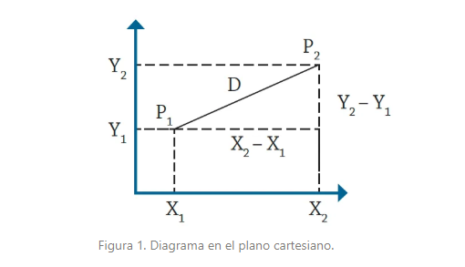
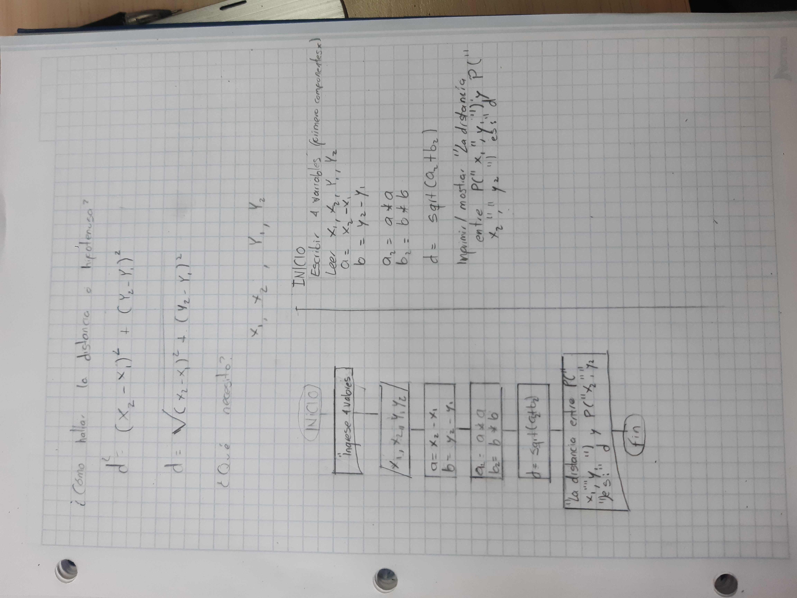
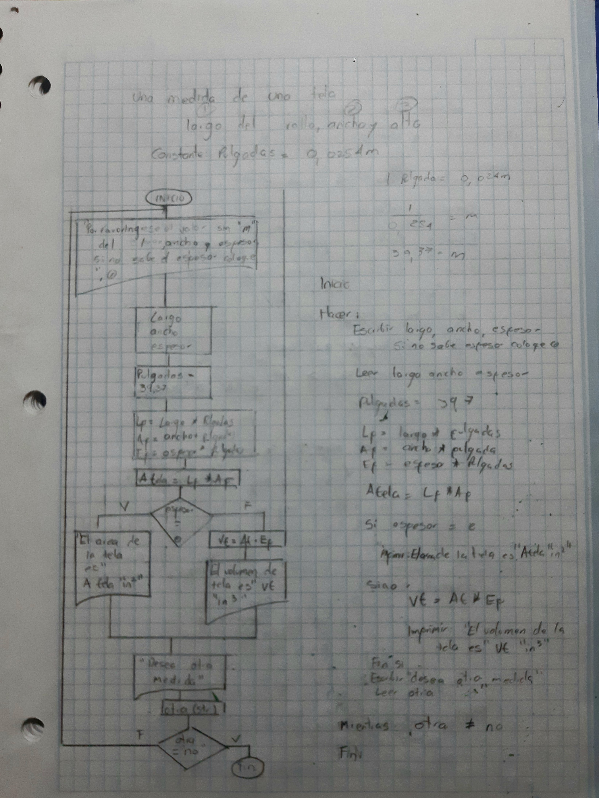
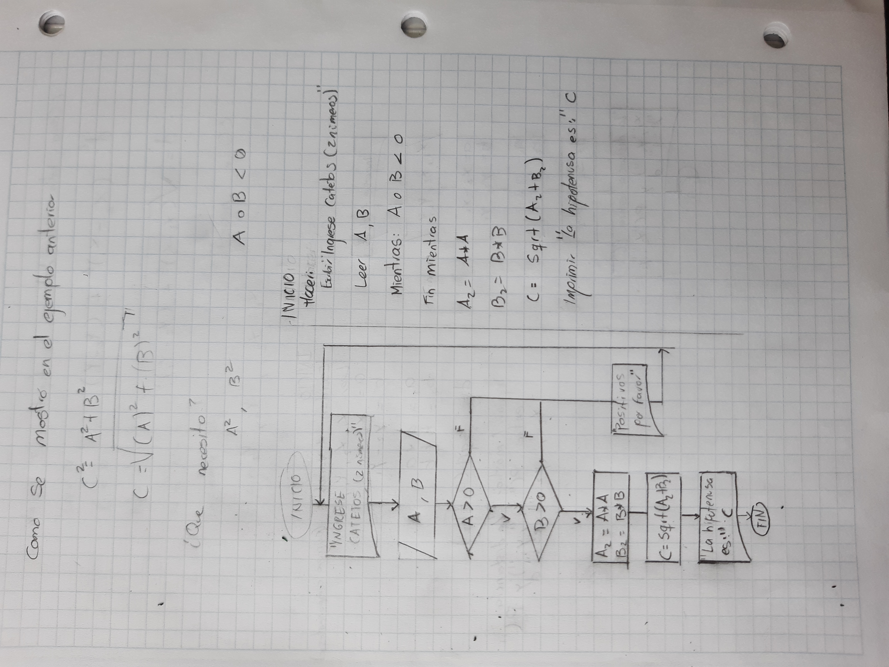
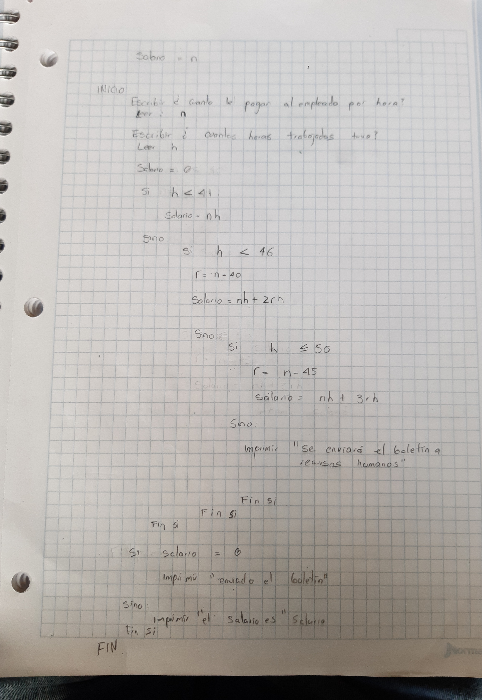
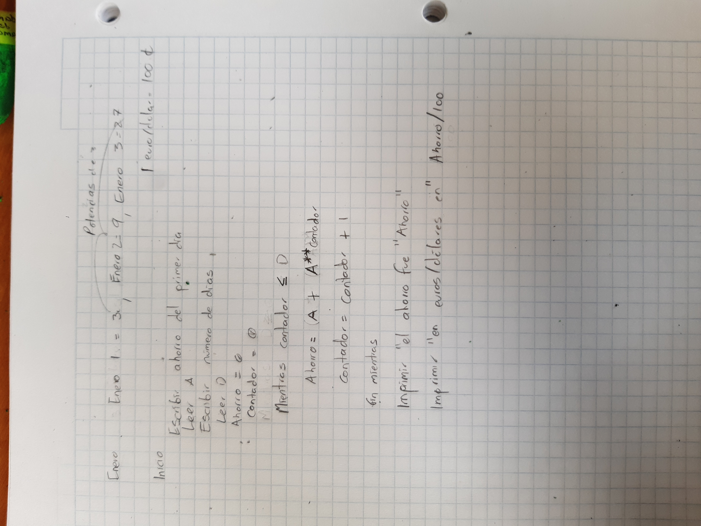
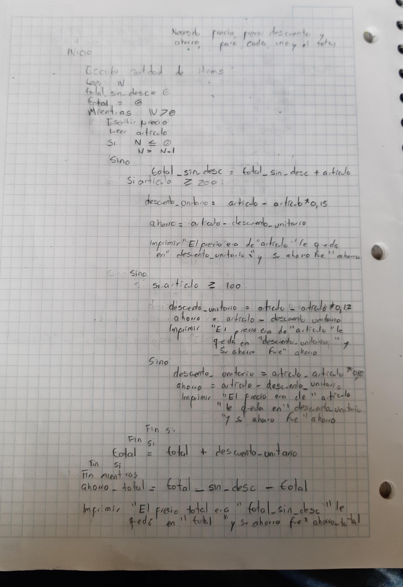
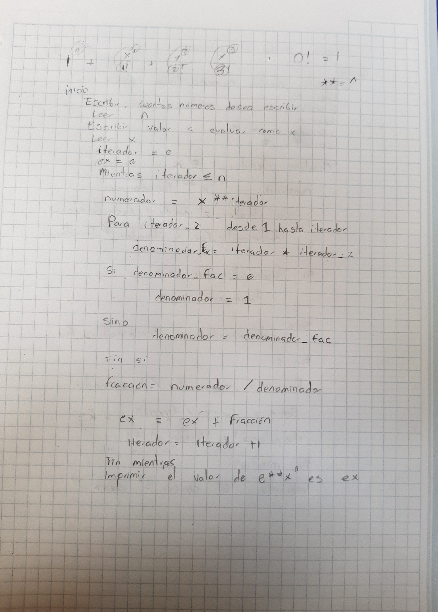
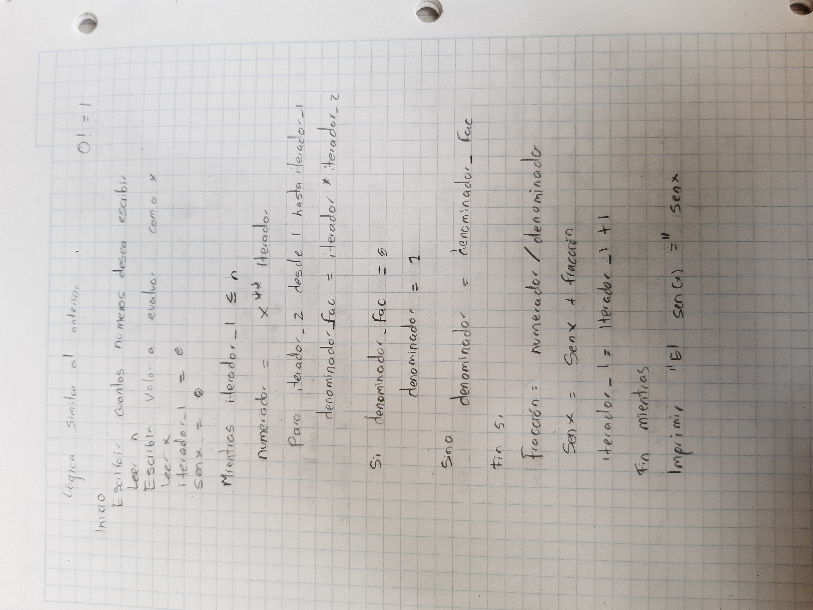

# Retos

### 📙 Agradecimientos al autor:

Los siguientes problemas fueron tomados del libro: **PROBLEMARIO DE ALGORITMOS RESUELTOS CON DIAGRAMAS  DE FLUJO Y PSEUDOCÓDIGO,** de los autores Francisco Javier Pinales Delgado y César Eduardo Velázquez Amador. Que se encuentra disponible en línea en [**este link**](https://tecnologosmic.wordpress.com/wp-content/uploads/2016/01/algoritmos-y-pseudocc3b3digos.pdf).

# Instrucciones

🔍 Para cada ejercicio, realice un análisis detallado y registre sus conclusiones en una tabla donde clasifique las variables de entrada, salida y las constantes. Enuncie las ecuaciones involucradas y explique el enfoque analítico que utilizará para plantear la solución.

1. Se requiere obtener la distancia entre dos puntos en el plano cartesiano,
tal y como se muestra en la figura 1. Realice un diagrama de flujo y pseudocódigo
que representen el algoritmo para obtener la distancia entre
esos puntos.

---

---
Figura 1. Diagrama en el plano cartesiano.

1. Una modista, para realizar sus prendas de vestir, encarga las telas al extranjero.
Para cada pedido, tiene que proporcionar las medidas de la tela
en pulgadas, pero ella generalmente las tiene en metros. Realice un algoritmo
para ayudar a resolver el problema, determinando cuántas pulgadas
debe pedir con base en los metros que requiere. Represéntelo mediante un
diagrama de flujo y pseudocódigo (1 pulgada = 0.0254 m).

---

2. Se requiere determinar la hipotenusa de un triángulo rectángulo. ¿Cómo sería el diagrama de flujo y el pseudocódigo que representen el algoritmo para obtenerla? 
Recuerde que por Pitágoras se tiene que: $C^2 = A^2 + B^2$.

---

3. Se requiere determinar la edad actual de una persona basándose en su fecha de nacimiento. Además, es necesario establecer si la persona ya ha cumplido años en el año en curso, si aún no lo ha hecho, o si hoy es su cumpleaños, para celebrarlo. La fecha de nacimiento y la fecha actual estarán representadas mediante tres variables: día, mes y año.

    
    **Pasos a seguir:**
    
    - Diseñe un algoritmo que permita calcular la edad de la persona.
    - Determine si la persona ya celebró su cumpleaños este año o si aún no lo ha hecho.
    - Verifique si la fecha actual corresponde al día de su cumpleaños. De ser así, imprima el mensaje “Feliz Cumpleaños”.
    - Represente la solución utilizando pseudocódigo claro y estructurado.

---

4. Realice un algoritmo que permita determinar el sueldo semanal de un trabajador con base en las horas trabajadas y el pago por hora, considerando que a partir de la hora número 41 y hasta la 45, cada hora se le paga el doble, de la hora 46 a la 50, el triple, y que trabajar
más de 50 horas no está permitido. Represente el algoritmo mediante pseudocódigo.

---

5. Se requiere un algoritmo para determinar, de N cantidades, cuántas son cero, cuántas son menores a cero, y cuántas son mayores a cero. Realice el pseudocódigo para representarlo, utilizando el ciclo apropiado.

---
6. Se requiere un algoritmo para determinar cuánto ahorrará en pesos una persona diariamente, y en un año, si ahorra 3¢ el primero de enero, 9¢ el dos de enero, 27¢ el 3 de enero y así sucesivamente todo el año. Represente la solución mediante pseudocódigo.

---

7. Realice el algoritmo para determinar cuánto pagará una persona que adquiere N artículos, los cuales están de promoción. Considere que si su precio es mayor o igual a $200 se le aplica un descuento de 15%, y si su precio es mayor a $100, pero menor a $200, el descuento es de
12%; de lo contrario, solo se le aplica 10%. Se debe saber cuál es el costo y el descuento que tendrá cada uno de los artículos y finalmente cuánto se pagará por todos los artículos obtenidos. Represente la solución mediante pseudocódigo.

---

8. Realice un algoritmo y represéntelo mediante pseudocódigo para obtener una función exponencial, la cual está dada por:
    
    $𝑒^𝑥 = 1+\frac x {1!} + \frac {x^2}{2!}+ \frac {x^3}{3!}+ …$

---
    
9. Realice un algoritmo para obtener el seno de un ángulo y represéntelo mediante pseudocódigo. Utilice la siguiente ecuación:
$Sen x = x - \frac{x^3}{3!} + \frac{x^5}{5!} - \frac{x^7}{7!} + ...$

---